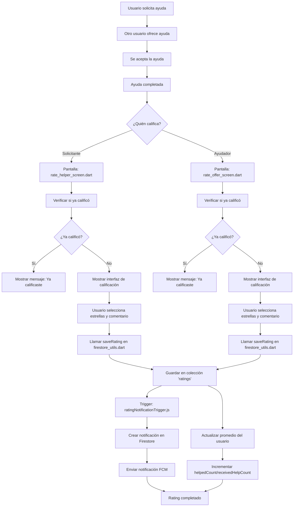
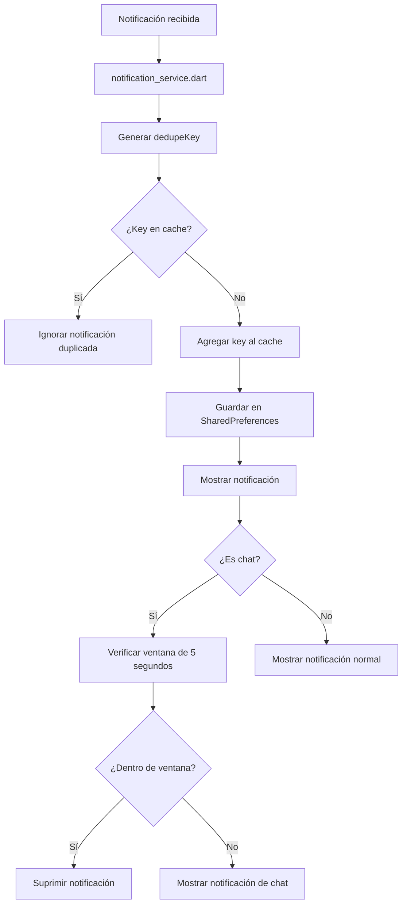

# Diagrama de Flujo - Sistema de Ratings Eslabón

## Flujo Principal de Ratings



## Flujo de Notificaciones

```mermaid
flowchart TD
    A[Rating creado en Firestore] --> B[ratingNotificationTrigger activado]
    
    B --> C[Obtener datos del rating]
    C --> D[Obtener FCM token del usuario calificado]
    
    D --> E{¿Token existe?}
    E -->|No| F[Log warning - No FCM token]
    E -->|Sí| G[Crear notificación en Firestore]
    
    G --> H[users/{userId}/notifications]
    H --> I[createNotificationTrigger activado]
    
    I --> J[Enviar notificación FCM]
    J --> K[Usuario recibe notificación]
    
    K --> L[notification_service.dart procesa]
    L --> M[inapp_notification_service.dart muestra]
```

## Flujo de Deduplicación



## Componentes del Sistema

### Frontend (Flutter)
- **rate_helper_screen.dart**: Interfaz para calificar ayudadores
- **rate_offer_screen.dart**: Interfaz para calificar solicitantes  
- **confirm_help_received_screen.dart**: Confirmación de ayuda recibida
- **ratings_screen.dart**: Visualización de ratings
- **ranking_screen.dart**: Ranking de usuarios

### Backend (Firestore)
- **Colección 'ratings'**: Almacena todas las calificaciones
- **firestore_utils.dart**: Lógica de guardado y cálculos
- **notification_service.dart**: Manejo de notificaciones
- **inapp_notification_service.dart**: Notificaciones locales

### Cloud Functions
- **ratingNotificationTrigger.js**: Trigger automático para ratings
- **createNotificationTrigger.js**: Trigger para notificaciones generales
- **sendRatingNotification.js**: HTTP endpoint para ratings manuales

### Esquema de Datos

```json
{
  "ratings": {
    "ratingId": {
      "sourceUserId": "string",
      "ratedUserId": "string", 
      "requestId": "string",
      "rating": "number (1-5)",
      "comment": "string",
      "type": "helper_rating | requester_rating",
      "timestamp": "Timestamp"
    }
  },
  "users": {
    "userId": {
      "averageRating": "number",
      "helpedCount": "number",
      "receivedHelpCount": "number",
      "fcmToken": "string",
      "notifications": {
        "notificationId": {
          "type": "rating_received",
          "title": "string",
          "body": "string", 
          "read": "boolean",
          "timestamp": "Timestamp",
          "data": "object"
        }
      }
    }
  }
}
```